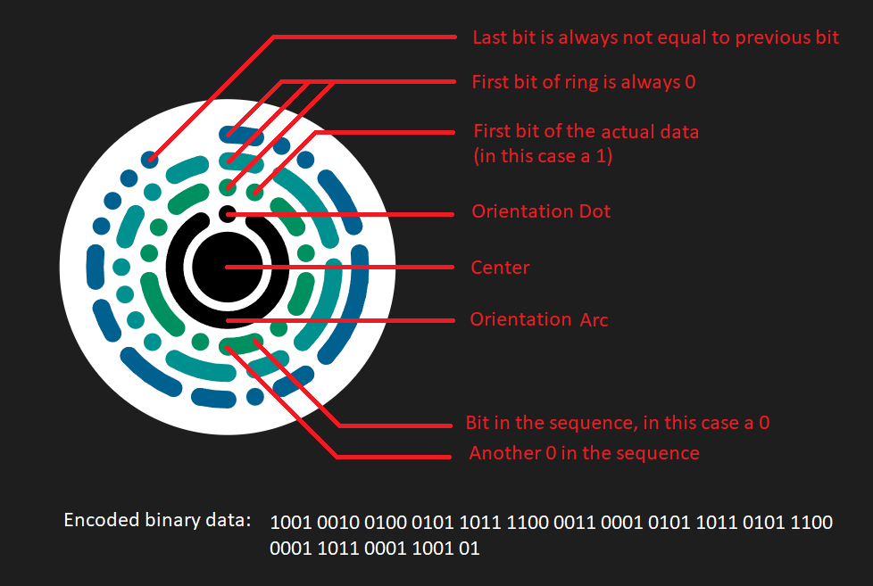

# Fancy Galaxy Code (FGC)
Fancy Galaxy Code (FGC) is an open source standard for fast and reliable data representation while maintaining a nice look and feel.  
FGC strifes to serve as a prettier QR-Code straight from the future.  
Contributions and integrations into projects are highly appreciated!  
  
## Links
[PyPI Package](https://pypi.org/project/fgc-tools/)  
[Online FGC Creator](https://ghostfox.de/fgc)  
  
## Specification

### Data processing
- 4 Version bits
- n Data + Hamming Code correction bits
- 1 end bit if last layer is not perfectly filled (can be cut when decoded)


### Data representation
#### General structure
Center point is thick and has a distance d to the arc surrounding it.  
All of the rings of data have exactly distance d to every previous and next ring.  
The dot in the ring around the center point represents the orientation (0 degrees).  

Every ring can store up to degrees_per_bit - 1 bits, since the first bit of every layer is always a 0.  
The degrees per bit can be looked up:  
```
Layer 1: 20° per bit = 360° / 20° - 1 bits = 17 bits 
Layer 2: 15° per bit
Layer 3: 12° per bit
Layer 4: 10° per bit
... 9, 8, 8, 6, 6, 6, 5, 5, 5, 5, 4, 4, 4, 4, 4 ...
After the last 4° layer (layer 19), every following layer (>= 20) has 3° per bit and can therefore store 360° / 3° -1 bits = 119 bits
```
  
#### Data representation
If the next bit is the same as this bit: Draw an arc  
If the next bit is not the same as this bit: Draw a dot  
    
#### Visual explanation

  
## Code execution
Before execution you have to install the requirements by executing:  
```
pip install -r requirements.txt
```  
  
Execution:  
```
python3 fgc_tools_creator.py 'Content of fgc' outputfile.svg
```
  
## Use the fgc-tools package
Install the package via:
```sh
pip install fgc-tools
```

Import the FGCCreator class and create an fgc:
```python
from fgc_tools import FGCCreator

FGCCreator.create_fgc(
    color_inner="#009060", 
    color_outer="#006090",
    data="Example", 
    output_file="example.svg",
    color_background="#ffffff",
    write_data_as_text=True
)
```  
  
## Example svg

